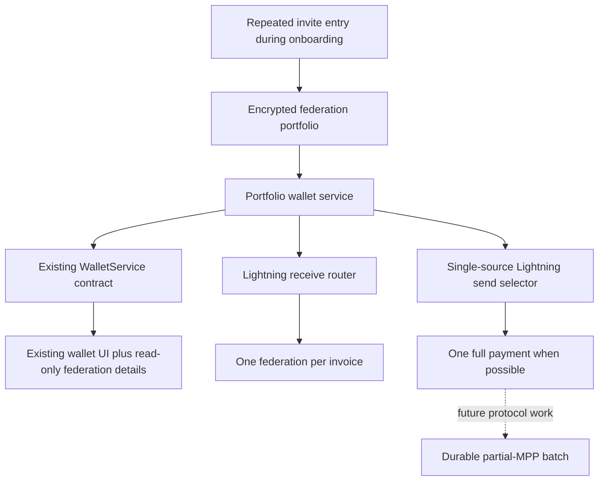

# Chascuro multi-federation Lightning plan and implementation status

## Revised product scope

Chascuro will add one onboarding option for joining multiple federations, then
show the connected federations and their balances in the existing advanced
Network settings panel. Multi-federation payment behavior remains behind the
existing wallet service boundary, with no other UI changes.

The implemented milestone:

- let the user manually join a small set of federations during onboarding;
- remove the Observer catalogue and every Observer dependency;
- add an “Add another federation” option to onboarding;
- add a read-only connected-federation list to advanced Network settings;
- keep the home, receive, send, and activity flows unchanged;
- follow the Fedimint SDK's client-per-federation model, using a stable SDK
  client name for each federation;
- choose one federation whenever a new Lightning invoice is created; and
- pay an outgoing Lightning invoice from one federation that can cover the
  complete amount and fee.

Cross-federation partial MPP is not part of the implemented milestone. The
installed SDK has no partial-payment RPC, so the MPP phases below remain a
future protocol roadmap rather than dormant application code.

This is not the original broader pooled-wallet product. Federation discovery,
federation-management UI, exposure controls, automatic rebalancing, and an
interactive federation-management screen remain outside this plan.

## Scope clarifications

### Multiple federations during onboarding

Reuse the existing invite entry, federation preview, and trust-confirmation
screens for every federation. After a successful join, the onboarding-ready
step offers:

- **Add another federation**, which returns to the existing invite screen; and
- **Go to wallet**, which completes onboarding.

The user may continue with one federation or add up to three. Every additional
federation must pass the same preview, network, module, and trust checks as the
first. Reject duplicate federation IDs and mixed Bitcoin networks before
joining. Persist each successful join before returning to the invite screen so
a reload cannot lose an SDK client that has already been created.

Outside onboarding, the only planned UI change is the read-only list of
connected federations and balances in advanced Network settings. Do not add
post-onboarding federation management or selection.

### Existing non-Lightning behavior

Keep the current ecash and Lightning choices in the wallet UI exactly as they
are. The portfolio exposes a combined balance through the existing balance
field.

Ecash, chat payments, and on-chain actions remain single-federation operations
and are not split across federations. For this phase, preserve their current
primary-federation behavior. This creates a known temporary limitation: the
combined balance can exceed the amount spendable by the ecash action. If the
primary federation cannot cover an ecash spend, return the existing
insufficient-funds error even if the portfolio total is sufficient. A later
change can refine this behavior without expanding the present Lightning scope.

## SDK compatibility gap and required prerequisite

The idea is possible within the intended architecture. The limitation is in
the public API of the SDK version currently installed by Chascuro, not in the
underlying named-client or Wasm design.

The intended SDK model is one named client per joined federation. Chascuro
should use that model instead of inventing a second federation database or
running one browser worker per federation.

The installed `@fedimint/core@0.1.3` cannot safely construct more than one
client-scoped wallet on a shared worker through its public API:

- `WalletDirector.createWallet()` constructs a wallet using the default client
  name.
- `FedimintWallet.open(clientName)` and `joinFederation(..., clientName)` can
  send a different name to the worker, but the wallet's balance, Lightning,
  mint, federation, recovery, and on-chain services remain bound to the name
  passed to the constructor.
- `FedimintWallet.cleanup()` closes the shared transport/worker, so it is not a
  per-federation close operation.

The worker RPC already understands named clients, so this does not require a
new Chascuro wallet architecture. For this fixed onboarding portfolio, the
minimum missing SDK surface is a way to construct every child wallet and its
services with the requested client name.

The current SDK main branch still has the same `createWallet()` limitation, and
its multiple-federations guide is currently a placeholder. An older reference
wallet uses legacy `listClients`, `openWallet`, and `getWallet` helpers from
`@fedimint/core-web`; those are not the API Chascuro currently depends on.

Do not work around this by opening the same OPFS database from multiple workers.
Before portfolio work, either upgrade to a released SDK that fixes client
scoping or contribute/use a narrowly pinned SDK change that provides:

```ts
interface MultiClientWalletDirector {
  createWallet(clientName: string): Promise<FedimintWallet>;
}
```

The exact API name may follow the upstream SDK. Chascuro can reopen the known
client names from its encrypted portfolio, cancel every child subscription at
lock, and clean up the shared transport once for the entire session. Client
listing and per-client close APIs are useful future SDK additions, but they are
not prerequisites while federation removal and post-onboarding management are
out of scope.

The required behavior is:

- every child service is constructed with the same client name used to
  join/open it;
- all clients share one initialized director, worker, mnemonic, and SDK
  database;
- child wallets do not individually call `cleanup()` while other clients are
  active;
- final session cleanup terminates the worker only after all subscriptions are
  stopped; and
- balances and operation subscriptions cannot leak between named clients.

## Target architecture



The UI continues to call the existing `createInvoice`, `quotePayment`, and
`pay` methods. Federation selection and MPP coordination remain below that
boundary.

## Release gate: prove the SDK multi-client lifecycle

The application adapter now constructs named clients through the pinned SDK's
`testing` export because the public director cannot do so. Before treating this
implementation as release-ready, add a repeatable integration test that proves
one SDK database and one worker can:

1. join two regtest federations using two stable UUID client names;
2. list or reopen both clients after a worker restart;
3. read distinct balances from both clients;
4. create an invoice from either client;
5. receive operation updates only from the addressed client; and
6. close the whole session without leaving a database or worker locked.

Add this to `test:e2e:sdk` or a new focused SDK test command. Until it passes
with the pinned SDK version, multi-client restart and OPFS lifecycle behavior
remain unproven release risks.

## Phase 1: add the encrypted federation portfolio

Replace the persisted single `activeFederation` field with a versioned
portfolio while retaining a designated primary federation for legacy
single-federation actions and the unchanged settings display.

```ts
interface FederationPortfolio {
  readonly primaryFederationId: FederationId;
  readonly federations: readonly ActiveFederation[];
}
```

Requirements:

- migrate the existing profile by wrapping `activeFederation` in a one-entry
  portfolio;
- after each successful onboarding join, let the user either add another
  federation through the existing invite/review screens or continue to the
  wallet;
- allow one to three portfolio entries during onboarding;
- assign and persist one stable UUID SDK client name per federation;
- reject duplicate federation IDs and duplicate client names;
- require all entries to use the same Bitcoin network;
- keep raw invite codes out of the persisted portfolio;
- open all known clients under the existing exclusive wallet-session lock;
- stop all child subscriptions before closing the shared SDK transport;
- ignore callbacks from an older locked or disposed generation; and
- preserve the current pending-join durability rules for every manual join.

Introduce a portfolio-backed implementation behind the existing
`WalletService` interface. Limit React changes to the onboarding-ready action,
its state-machine transition, and the connected-federation summaries exposed in
the existing advanced Network panel.

`OperationKey` already includes `federationId + operationId`; preserve that
identity for all child operations. Aggregate only at the portfolio boundary,
never by discarding the child federation ID.

## Phase 2: route incoming Lightning invoices

Each invoice remains a normal invoice created by exactly one federation and
one gateway.

When `createInvoice` is called:

1. refresh the balance of every open federation client;
2. if the combined balance is zero, select the primary federation;
3. otherwise score every client using projected post-receive allocation and
   break ties deterministically by federation ID;
4. require Lightning support on the selected federation;
5. refresh that client's gateway cache, prefer a valid vetted gateway and
   otherwise select the first valid gateway returned by `listGateways()`, then
   bind the request to that gateway explicitly;
6. call `createInvoice` exactly once through that federation and gateway; and
7. return the existing `LightningReceive` shape to the UI.

For equal target weights, a suitable base score is the projected deviation
from the equal allocation after adding the invoice amount. This naturally sends
successive receives toward the least-funded federation without adding user
configuration.

Safety rules:

- once an invoice is returned to the UI, it never changes federation;
- do not fall back to another federation or create a second invoice when
  balance refresh, gateway selection, invoice creation, or invoice lifecycle
  handling fails;
- never replace or redirect an already presented invoice;
- restore the chosen client when recovering an encrypted invoice;
- do not redistribute funds after receipt; and
- do not use catalogue ratings or cached third-party health data.

The current receive screen and its props must not change.

## Phase 3: validate receive routing

Unit tests:

- equal and unequal balances;
- deterministic tie-breaking;
- an all-zero portfolio selecting the primary federation;
- missing Lightning module;
- no usable gateway;
- selected-route failure creating no second invoice;
- no fallback after presentation;
- profile migration and duplicate rejection; and
- stale-session callbacks being ignored.

SDK/regtest tests:

- invoices can be created through both named clients;
- repeated receives move balances toward the target allocation;
- restart restores the client associated with a pending invoice; and
- locking cancels unfinished selection/invoice work without killing a future
  unlock.

Milestone: repeated incoming Lightning payments are distributed across the
federations joined during onboarding with no changes to the receive UI.

## Phase 4: add partial-MPP capability end to end

NUT-15 is a Cashu specification, so this implementation should be described as
“NUT-15-inspired” unless Fedimint adopts a compatible specification. The useful
pattern is:

1. quote the same BOLT11 invoice at multiple issuers/gateways with an explicit
   partial amount;
2. ensure partial amounts sum exactly to the invoice amount; and
3. submit all partial payments concurrently so the Lightning receiver releases
   the shared preimage only when the complete MPP arrives.

### Coordinator ownership boundary

The coordinator is local to the unlocked Chascuro wallet. There is no hosted
coordinator, no federation-to-federation communication, and no new
cross-federation consensus protocol.

Chascuro owns:

- decoding and validating the invoice amount, expiry, payment hash,
  `payment_secret`, and `basic_mpp` feature;
- reading client balances and versioned gateway capabilities;
- selecting one to three federation-qualified shards;
- allocating exact shard amounts and fee limits;
- persisting the parent batch before any dispatch side effect;
- dispatching eligible shards concurrently;
- reconciling every shard after lock, reload, timeout, or ambiguous failure;
  and
- exposing one parent wallet operation to the existing UI.

Chascuro does not construct Lightning HTLCs, make gateways coordinate with one
another, or turn the payment into a perfectly atomic cross-federation
transaction. Each selected gateway remains responsible for constructing and
routing its own partial HTLC through its Lightning backend.

For BOLT11 basic MPP, every shard must use the same payment hash,
`payment_secret`, and `total_msat`; only the shard amount differs. The invoice
must advertise `basic_mpp`. The batch ID and shard ID are Chascuro/Fedimint
idempotency fields and are not Lightning wire-level MPP fields.

The installed Fedimint SDK exposes only full-invoice payment. The current
Fedimint gateway Lightning trait also pays a complete invoice and has no
partial-amount argument. This phase therefore requires a separately testable
change through the whole stack:

- web SDK and Wasm RPC;
- Fedimint Lightning client;
- funded outgoing contract calculation;
- a versioned gateway request and capability endpoint; and
- supported Lightning backends.

### Feasibility result from the code-path audit

This design is technically feasible, but not as a Chascuro-only change and not
through unmodified public gateways.

The important boundary is narrower than a new federation protocol:

- the existing LNv1 `OutgoingContract` commits to a payment hash, gateway key,
  timelock, user key, and cancellation flag;
- its `OutgoingContractAccount` already carries an arbitrary funded amount;
- guardians do not validate that this amount equals the BOLT11 invoice amount;
  and
- the same preimage can therefore redeem independently funded contracts in
  different federations.

The full-invoice restriction is imposed outside guardian consensus. The current
Fedimint client derives the contract amount from the invoice amount plus the
gateway fee. The current gateway independently derives the required amount and
maximum routing fee from that same full invoice amount. Both checks must be
extended to use a separately authenticated shard amount while preserving the
invoice's full amount as `total_msat`.

The gateway announcement already includes `node_pub_key`. The first
implementation must reject a multi-shard plan that selects the same Lightning
node for more than one independently dispatched shard. The current Fedimint
LND and LDK adapters identify and reconcile an outbound payment by payment hash,
not by Chascuro shard ID. LND's low-level route API can add multiple MPP
attempts to one in-flight payment, but safely attributing and retrying those
attempts would require a shared node-level coordinator. Different gateways
backed by distinct Lightning nodes keep the initial shard idempotency boundary
unambiguous.

Do not add an MPP field to the federation-encoded `LightningGateway` record for
the first implementation. Discover support from a versioned endpoint under the
gateway's already announced API URL and bind its response to the announced
`gateway_id` and `node_pub_key`. This avoids a guardian/schema upgrade and
prevents an old gateway from accidentally receiving a partial request through
the legacy full-payment endpoint.

#### Lightning backend result

For LND, the normal `SendPaymentV2` call is not sufficient: its amount is the
complete payment that LND itself will try to deliver, even when LND internally
uses multiple paths. An externally coordinated shard requires the lower-level
route flow:

1. find or build a route for the shard amount;
2. set the final hop's MPP record to the invoice `payment_secret` and full
   `total_msat`;
3. submit that one route with `SendToRouteV2`; and
4. wait for the HTLC attempt to settle or fail.

This is a viable first backend. It needs explicit route retry, fee accounting,
mission-control reporting, idempotency, and status reconciliation because the
high-level LND payment loop no longer supplies those automatically.

Fedimint's LDK backend currently calls the high-level
`bolt11_payment().send(...)` path, which owns the complete payment. The
underlying rust-lightning code constructs each onion with a separate
`amt_to_forward` and `total_value`, so the protocol primitive exists, but the
public wrapper does not expose “send this one path for `shard_msat` while
advertising `total_msat`.” Supporting LDK therefore needs an additional
rust-lightning/fedimint-ldk-node API and should follow, rather than block, the
LND proof-of-concept.

### Minimum proof-of-concept stack

Build and test this as pinned forks before changing Chascuro's default payment
path:

1. fork the Fedimint client/Wasm and add prepare, dispatch, status, and refund
   RPCs for an MPP shard;
2. fund each outgoing contract with `shard_msat + gateway_fee(shard_msat)`,
   while retaining the original invoice, payment hash, `payment_secret`, and
   full `total_msat`;
3. add a new versioned gateway capability and shard-payment endpoint, leaving
   the legacy full-payment endpoint untouched;
4. extend the gateway's LND adapter with the lower-level route/send flow above;
5. run two gateway instances backed by two distinct LND nodes and registered
   with two test federations; and
6. have Chascuro coordinate two shards only after all capability, invoice,
   balance, fee, expiry, and distinct-node checks pass.

The initial feature must fail closed when any selected gateway lacks the new
endpoint. Existing public gateways remain full-payment-only. A modified gateway
can register with an otherwise unmodified federation, so the first end-to-end
test should not require guardian changes.

The protocol must carry:

- the original invoice and payment hash;
- the invoice's `payment_secret`, MPP feature, and expiry;
- the shard amount in millisats;
- the invoice total amount in millisats;
- a stable batch ID and shard ID;
- a hard per-shard and total fee ceiling;
- an advertised minimum shard amount;
- an idempotency key; and
- enough invoice data for the Lightning backend's MPP/payment-address rules.

Do not assume all gateways support this. Partial MPP is eligible only when every
selected client/gateway explicitly advertises and successfully quotes it.

Quote/preparation must have precise semantics. A quote may reserve nothing and
perform no payment side effect. A separate prepare step is optional, but if it
funds a contract, reserves balance, or can initiate an HTLC, the coordinator
must treat it as dispatch: persist the batch first and reconcile it as a
non-idempotent external side effect. The application must not infer a safe
two-phase commit from an API name.

This phase belongs behind a regtest-only feature flag until refund, retry,
expiry, and crash behavior are proven. No production fallback may reinterpret
a partial-MPP request as a full-invoice payment.

## Phase 5: outgoing Lightning planner

Keep the existing parse and confirmation UI. `quotePayment` becomes a portfolio
quote:

1. prefer one healthy federation that can cover the full amount and fee;
2. use partial MPP only when no eligible single federation can pay;
3. use the fewest shards necessary;
4. prefer spending from over-allocated federations;
5. request and validate every partial quote before returning one combined quote
   to the UI; and
6. bind the confirmed quote to the invoice fingerprint, complete shard plan,
   gateway identities, expiries, and total maximum fee.

Every plan must prove:

- shard amounts sum exactly to the invoice amount;
- each federation covers its shard plus its maximum fee;
- every shard satisfies its gateway minimum;
- every selected gateway advertises compatible partial MPP;
- all quotes remain valid through confirmation;
- total maximum fees fit the user's existing fee limit; and
- the output is deterministic for the same inputs.

Payment-size bands may cap the number of shards as wallet policy, but they do
not force unnecessary splitting and are not protocol rules. An initial policy
could be:

- up to 500 sats: one federation;
- 501–2,500 sats: at most two federations; and
- above 2,500 sats: at most three federations.

Within that cap, prefer a single federation that can fund the complete payment,
then use the fewest shards needed. Liquidity, gateway minimums and maximums,
fees, expiry, capability, and deterministic tie-breaking still decide whether
a plan is valid. A payment that cannot be funded within the policy cap fails
before dispatch.

## Phase 6: durable MPP batch coordinator

The current wallet API and activity UI expect one outgoing operation. Persist
one parent payment batch and keep its federation shards as internal child
operations.

```ts
interface LightningPaymentBatch {
  readonly batchId: string;
  readonly protocolVersion: number;
  readonly invoiceFingerprint: PaymentFingerprint;
  readonly paymentHash: string;
  readonly secretRecordRef: SecretRecordRef;
  readonly amountMsats: Msats;
  readonly maximumFeeMsats: Msats;
  readonly expiresAtMs: number;
  readonly state: LightningBatchState;
  readonly shards: readonly {
    readonly shardId: string;
    readonly federationId: FederationId;
    readonly clientName: ClientName;
    readonly gatewayId: string;
    readonly amountMsats: Msats;
    readonly maximumFeeMsats: Msats;
    readonly quoteId?: string;
    readonly quoteExpiresAtMs?: number;
    readonly operationId?: OperationId;
    readonly state: LightningShardState;
  }[];
}
```

Suggested states:

```text
planning -> quoted -> confirmed -> dispatching -> settling -> settled
                                        |             |
                                        v             v
                                   reconciling -> refunding
                                        |          |
                                        v          v
                                   failed/expired  refunded
```

After the existing UI confirmation:

1. persist the confirmed batch, protocol version, invoice secret reference, and
   all shard IDs;
2. submit all quoted partial payments concurrently;
3. persist every returned federation operation ID;
4. reconcile every ambiguous child before retrying;
5. derive the parent state from all children and the shared preimage; and
6. expose one synthetic/parent `lightning_send` operation through the existing
   activity contract.

Critical rules:

- persist before and after every non-idempotent external side effect;
- never start a full-invoice fallback after any shard may have been dispatched;
- retry only operations whose SDK/gateway contract is demonstrably idempotent;
- treat the receiver's valid preimage as proof of payment settlement;
- continue reconciling and refunding incomplete child contracts after the
  preimage is known;
- never report an unknown child as failed merely to make the parent terminal;
  and
- retain enough encrypted state to resume after lock, reload, or crash.

Shard state must distinguish at least planned, quoted, submitted, pending,
settled, refunding, refunded, failed-before-dispatch, and unknown/ambiguous.
The parent cannot report failure while any shard may still be live.

The original plan's separate `preparePartialPayment` and
`dispatchPartialPayment` stages are not assumed. Add such a two-phase protocol
only if the Fedimint client and gateway explicitly implement and document its
reservation, expiry, idempotency, and cancellation semantics; Lightning MPP
itself does not provide two-phase commit.

## Phase 7: MPP validation and release gates

Planner tests:

- one federation can pay, so MPP is not used;
- two and three federation splits;
- shard-count policy caps at each amount boundary;
- exact millisat summation;
- insufficient aggregate funds;
- per-gateway minimum shard amounts;
- quote expiry;
- total fee ceiling;
- invoices without `basic_mpp` or a valid `payment_secret`;
- unsupported gateway exclusion; and
- deterministic planning.

Coordinator/regtest tests:

- two independent Lightning backends complete one MPP invoice;
- every dispatched shard uses the same payment hash, `payment_secret`, and
  `total_msat`;
- quoting produces no contract, balance reservation, or HTLC side effect;
- all children return the same preimage;
- one shard fails before dispatch;
- one shard becomes ambiguous during dispatch;
- wallet reload during dispatch and settlement;
- quote expiry between confirmation and submission;
- delayed contract cancellation/refund;
- duplicate submission with the same batch/shard IDs;
- no full-payment fallback after partial dispatch; and
- the unchanged UI shows one outgoing payment, not one row per shard.

Release gates:

- pin the exact SDK, Fedimint client, gateway, and Lightning backend revisions;
- update `THREAT_MODEL.md` with multi-client OPFS and MPP failure modes;
- keep fake-wallet tests separate from protocol claims;
- complete live regtest testing with at least two federations and two gateways;
- obtain independent review of batch idempotency, preimage handling, and refund
  recovery; and
- continue to prohibit real-funds use until existing recovery gates and these
  new gates pass.

## Explicit non-goals

- Observer API or any federation catalogue;
- post-onboarding federation-management or federation-selection UI;
- UI changes beyond onboarding and the read-only advanced Network details;
- splitting an incoming invoice across federations;
- background fund redistribution;
- configurable allocation weights or exposure limits;
- automatic federation replacement/removal;
- splitting ecash or chat payments across federations;
- changing guardian consensus; and
- claiming Fedimint NUT-15 compatibility without an adopted Fedimint protocol.

## Implemented-milestone acceptance criteria

The current milestone is complete when:

1. onboarding lets the user manually join one to three federations using the
   existing invite preview and trust flow;
2. all joined named SDK clients reopen safely from one wallet session;
3. advanced Network settings show all connected federations and balances, with
   no other post-onboarding UI changes;
4. each new Lightning receive is deterministically assigned to one eligible
   federation and remains bound to it;
5. a normal outgoing payment uses one federation whenever possible;
6. an invoice that no single federation can fund fails with insufficient
   balance rather than drafting or dispatching an unsupported split payment;
7. crash/reload reconciliation preserves each operation's federation identity;
   and
8. live two-federation restart, receive, and gateway-failure cases pass before
   any real-funds claim.

Phases 4–7 define separate future acceptance criteria for partial MPP. They do
not describe behavior currently shipped by Chascuro.
